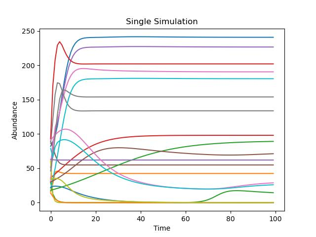
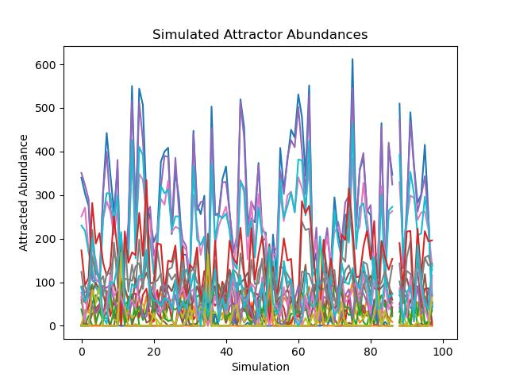
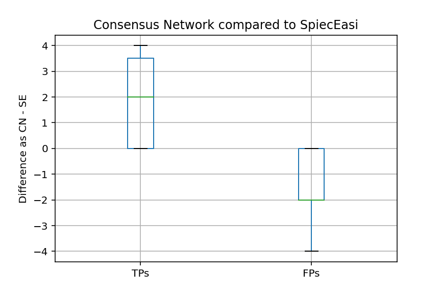

# Snakemake Pipeline for Multi-Species Predator-Prey Dynamics and Network Inference

This repository contains a **Snakemake pipeline** for:
1. Simulating multi-species predator-prey dynamics using the **generalized Lotka-Volterra (gLV) model**.
2. Inferring ecological networks using seven different inference methods.
3. Analyzing and benchmarking inference quality (TP/FP rate, PPV).

## Requirements

A working **Python** and **R** environment is required. While code editors such as Spyder (Python) and RStudio (R) are recommended for modifying scripts, they are not strictly necessary.

This guide includes setup instructions for R dependencies using RStudio.

---

## Workflow Overview

### **1. Generating Synthetic Networks**
- `generateBasicSyntheticNetwork`:
  - Creates a synthetic network topology (cluster, scale-free, or band) with *n* species.
  - Serves as the basis for simulation.

### **2. Generating Synthetic Abundance Data**
- `generateSyntheticAbundanceData_gLV`:
  - Assigns random interaction strengths to synthetic network edges.
  - Simulates species abundances using the generalized Lotka-Volterra model.
  - Extracts attractor states as a sample to form a final abundance matrix for each simulation.
  - Infers ESABO networks from abundance data.
  
### **3. Inferring Networks with R Methods**
- `inferNetworksR`:
  - Uses the simulated abundances to infer networks using R-based inference methods:
    - SpiecEasi, CCREPE, SPARCC, Spearman, propr, ecoCopula.

### **4. Benchmarking Inference Quality**
- `benchmarkInferenceQuality`:
  - Aggregates results and compares inferred networks to the original synthetic network.
  - Generates plots showing true positive (TP) / false positive (FP) rates and positive predictive values (PPV).
 
### **(Optional) Compare Consensus Network with SpiecEasi of similar size (high threshold, HT)**
- `inferOnlySENetworksR`:
  - Infers and exports SpiecEasi network with weighted edges/associations to match the size of the Consensus Network.
  - Script 6_benchmark_SE_HT.py generates plots showing difference in amount of true positives (TP) and false positives (FP).
---

## **1. Setting Up the Python Environment**

### **Install Miniforge (Recommended for Conda Management)**
[Miniforge Repository](https://github.com/conda-forge/miniforge)

Verify installation:
```bash
conda --version
```

### **Clone the Repository**
Or download and extract the repository as a .zip from Github and extract into a new FoodWeb_gLV folder.
```bash
cd /your/project/folder
git clone https://github.com/v-dinkel/FoodWeb_gLV
cd FoodWeb_gLV
```

### **Create and Activate a Conda Environment**
The repository contains a requirements.txt which includes the python packages and versions. In the terminal (you should be in the directory of the FoodWeb_gLV folder): 
```bash
conda create --name foodweb_glv --file requirements.txt
conda activate foodweb_glv
```

If Conda is not recognized, try:
```bash
source ~/.bashrc
```

### **Install Snakemake**
Snakemake is not included in `requirements.txt`. Install it manually:
```bash
conda install -c conda-forge -c bioconda snakemake
```
Verify installation:
```bash
snakemake --version
```

### **(Optional) Set Python Interpreter in Spyder**
- Open Spyder
- Navigate to Tools > Preferences > Python Interpreter
- Select: `/home/user/miniforge3/envs/foodweb_glv/bin/python`

---

## **2. Setting Up the R Environment**

### **Install R and RStudio**
Install R and RStudio from the official source.

### **Open `inferNetworks.R` in RStudio**
- Install packages NetComi (https://github.com/stefpeschel/NetCoMi) and ecoCopula.
  ```r
  install.packages("ecoCopula")
  ```

### **Handling Missing System Dependencies**
- If you encounter errors like `ERROR: dependency '...' is missing`, resolve them by installing missing dependencies. For that you likely require devtools:
  ```r
  install.packages("devtools")
  ...
  ```
- Using devtools, you can install packages like propr:
   ```r
  devtools::install_github("tpq/propr")
  ...
  ```
- Some packages (e.g., `devtools`) require additional **system** dependencies, which need to be installed outside of R. 
- Packages SpiecEasi, SPRING, and NetComi require **multiple** dependencies, which might conflict with OS or R versions. In this case specific package versions have to be hand-picked.

### **Installing Specific Package Versions**
If needed, use **remotes** to install specific versions:
```r
install.packages("remotes")
remotes::install_version("Matrix", version="1.6")
```

---

## **3. Configuring Snakemake**

Modify `config.yaml` to set the working directory (absolute path required).

### **Key Configuration Variables:**
- `n`: Number of species (*e.g., n = 20*). Higher values increase processing time.
- `seed`: Random seed for reproducibility.
- `nettype`: Network topology (*cluster, scale-free, band*). Uses SpiecEasi.
- `r_methods`: Inference methods to run (6 in R, plus ESABO in Python inferred during abundance simulation).
- `nsimulations`: Number of abundance simulations and corresponding network inferences.

---

## **4. Running the Snakemake Pipeline**

> **Note:** This pipeline does not use Snakemake rule dependencies for a fully automated workflow. This prevents unintended cleanup, allowing manual inspection of intermediate results.

Run individual steps manually in the **terminal** using:
```bash
conda activate foodweb_glv
snakemake -j 4 generateBasicSyntheticNetwork
snakemake -j 4 generateSyntheticAbundanceData_gLV
snakemake -j 4 inferNetworksR
snakemake -j 4 benchmarkInferenceQuality
(optional): snakemake -j 4 inferOnlySENetworksR
```

(`-j 4` sets the number of processors; adjust as needed.)

Troubleshooting:
- you may encounter "Rscript" error, which means that your R folder is not in the PATH variable. Add the /bin folder of your R directory to the PATH variable and make sure that you can execute "Rscript" in the terminal

---

## **5. Outputs**

Outputs are stored in `outputs/<seed>/`.

| Folder      | Description  |
|------------|-------------|
| **graphs/**     | Synthetic network topology graphs created in **first pipeline step**. |
| **abundances/**  | Contains abundance data from simulations. Includes plots illustrating generalized Lotka-Volterra simulations from **second pipeline step**. <br /> |
| **networks/**    | Inferred networks for each simulation from **third pipeline step**. |
| **benchmark/**   | Aggregated inference results with TP/FP and PPV plots as output from **fourth pipeline step**.<br /> <br /> (Optional) The fifth pipeline step and corresponding script 6_benchmark_SE_HT.py adds comparison of Consensus Network with SpiecEasi network of similar size: <br /> | 

---

## **Notes & Troubleshooting**
- Avoid installing R packages inside the script during snakemake execution – manage package installation manually.
- During the first execution, NetComi may install missing R packages.
- Network inference can occasionally freeze terminal output. If stuck, try pressing Enter in the terminal.

---

### **Author**
Viktor Dinkel - kontakt@v-dinkel.de

---

